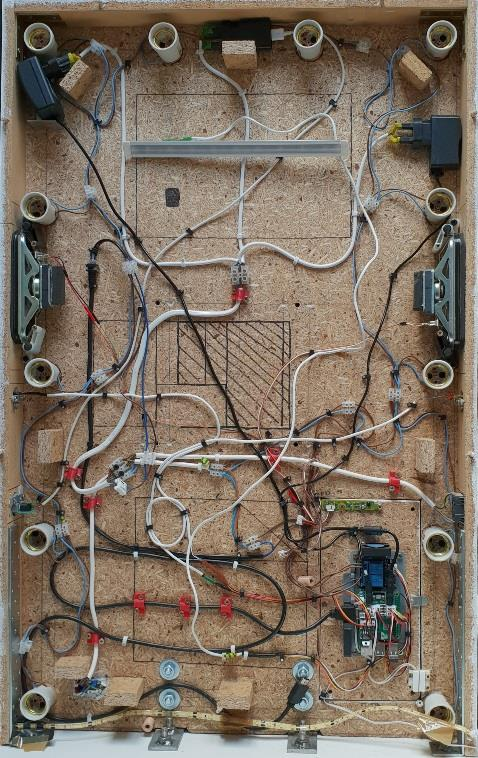
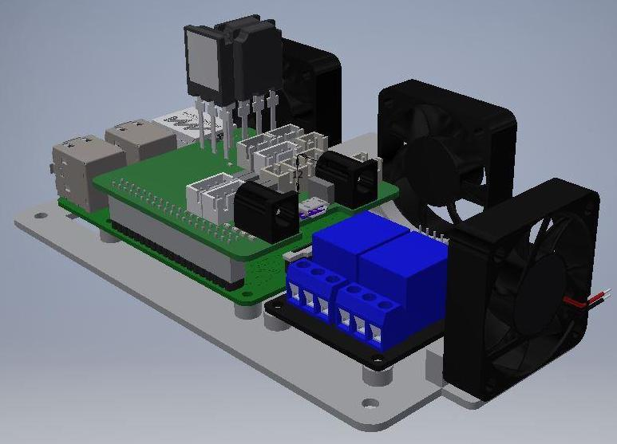

# Logopedy Mirror
Standalone platform/appliance designed for audivisual support for children's mixed aphasia (severe speaking and comprehension impairment).

## Features
* support the treatment therapy of mixed aphasia among children
* proposal of some basic exercises
* integrated buttons and led strip for deepening user experience and interaction

### To be added
* microphone for interaction with voice assistant
<html>

    

        
    

    

        
    

    

         
    

    

         
    

</html>

